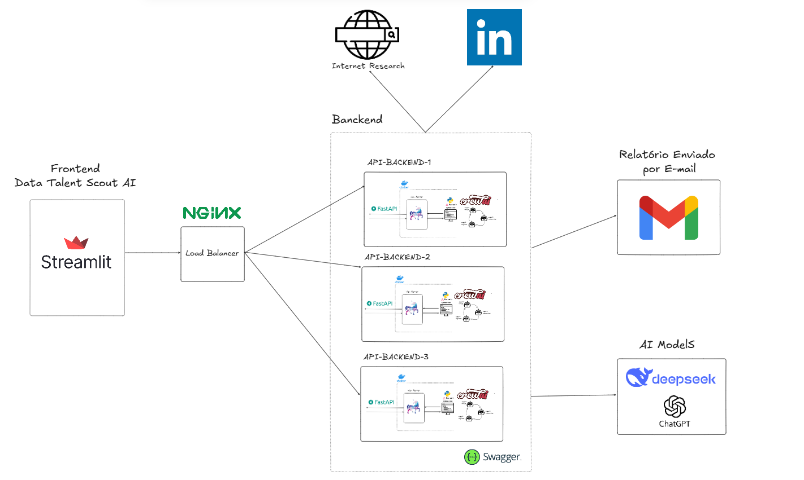

<h1 align="center">Data Talent Scout AI</h1> 

<div align="center">
  
  
  
</div>

<p align="center">

</p>

## Visão Geral

Este projeto é um sistema inteligente de recrutamento especializado em vagas de dados, utilizando agentes de IA para identificar os melhores candidatos com base nos requisitos da vaga. A aplicação integra um backend desenvolvido em FastAPI, agentes de IA construídos com CrewAI e um frontend interativo em Streamlit. O objetivo é facilitar o processo de recrutamento, permitindo que recrutadores encontrem candidatos qualificados de maneira eficiente e automatizada.

<p align="center">

</p>

## Funcionalidades
- Busca de Candidatos: Utiliza um agente de IA para realizar pesquisas online e encontrar os top 5 candidatos que atendem aos requisitos da vaga.
- Interface Intuitiva: Frontend em Streamlit que permite aos usuários inserir os requisitos da vaga e visualizar os resultados de forma clara (Geração estruturada de relatórios de candidatos).
- Envio de Resultados por E-mail: Possibilidade de enviar os resultados da busca diretamente para um e-mail especificado.
- Feedback em Tempo Real: Exibe informações sobre o uso de tokens e o tempo de execução da busca.

## Tecnologias Utilizadas
- Backend: FastAPI
- Agentes de IA: CrewAI
- Ferramenta de Busca: SerperDevTool
- Frontend: Streamlit
- Envio de E-mails: Biblioteca personalizada (sendmail.py)

## Instalação

1. Clone o repositório:
```bash
git clone https://github.com/seu-usuario/ai-agents-hub.git
cd ai-agents-hub/02 - Recursos Humanos (RH)/Data_Talent_Scout_AI
```

2. Instale as dependências:
```bash
pip install -r requirements.txt
```

3. Configure as chaves de API no arquivo `.env`:
```env
OPENAI_API_KEY=sua-chave
SERPER_API_KEY=sua-chave
```

4. Prepare o Frontend
- Certifique-se de que o arquivo sendmail.py esteja configurado corretamente para enviar e-mails.

## Executando a Aplicação

1. Inicie o Servidor FastAPI:
```bash
uvicorn app:app --reload
```
- O servidor será executado em http://127.0.0.1:8000.

2. Execute o Frontend Streamlit
```bash
streamlit run frontend.py
```
- A interface será aberta no seu navegador padrão.

3. Se preferir, pode usar o Curl para enviar uma requisição POST :
```bash
curl -X POST "http://localhost:8000/research_candidates" \
-H "Content-Type: application/json" \
-d '{"job_requirements": "Data Scientist com experiência em Python, Machine Learning e 5+ anos de experiência na cidade de São José do Rio Preto"}'
```

**Exemplo de Resposta:**
```json
{
  "result": "• João Silva - Senior Data Scientist @ TechCorp\n  - Linkedin: [Perfil](https://linkedin.com/in/joaosilva)\n  - Experiência: 6 anos com ML em produção\n  • Maria Souza - Lead Data Engineer @ DataWorld..."
}
```

## Como Usar
1. Insira os Requisitos da Vaga
- No campo de texto, digite os requisitos específicos da vaga, como habilidades, certificações e localização.
2. Inicie a Busca
- Clique no botão "Buscar" para iniciar a pesquisa de candidatos.
- Um GIF de carregamento será exibido enquanto a busca está em andamento.
3. Visualize os Resultados
- Após a conclusão da busca, os top 5 candidatos serão listados, incluindo informações de contato, breve descrição do perfil e URL para o perfil.
- Informações adicionais, como uso de tokens e tempo de execução, também serão exibidas.
4. Envie os Resultados por E-mail
- Insira o e-mail do destinatário no campo fornecido.
- Clique no botão "Enviar E-mail" para enviar os resultados da busca.

## Estrutura do Projeto

```
.
├── app.py            # Configuração principal da API e agentes
├── requirements.txt  # Dependências do projeto
└── README.md         # Documentação
```

## Configuração 🔧

| Variável de Ambiente | Descrição                           | Como Obter                 |
|----------------------|-----------------------------------|---------------------------|
| `OPENAI_API_KEY`     | Chave da API OpenAI               | platform.openai.com        |
| `SERPER_API_KEY`     | Chave da API de Pesquisa Serper   | serper.dev                |


