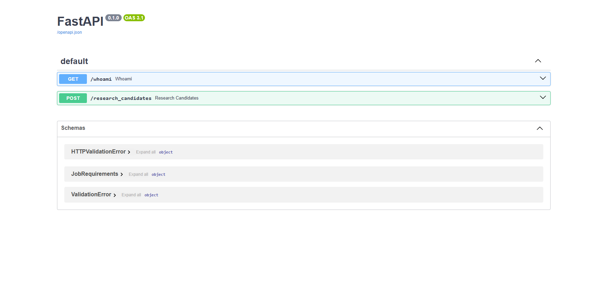
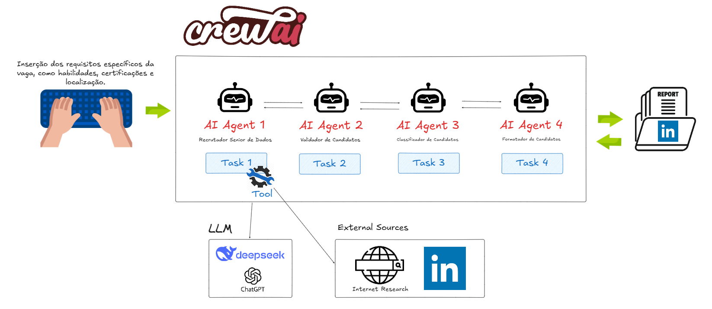
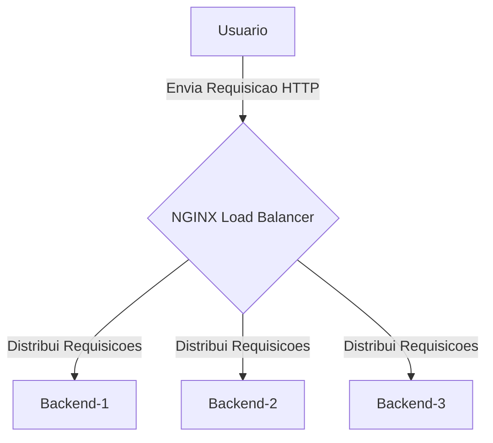
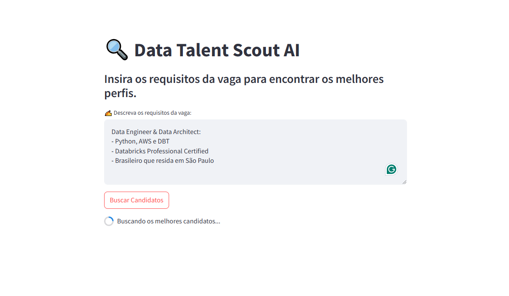
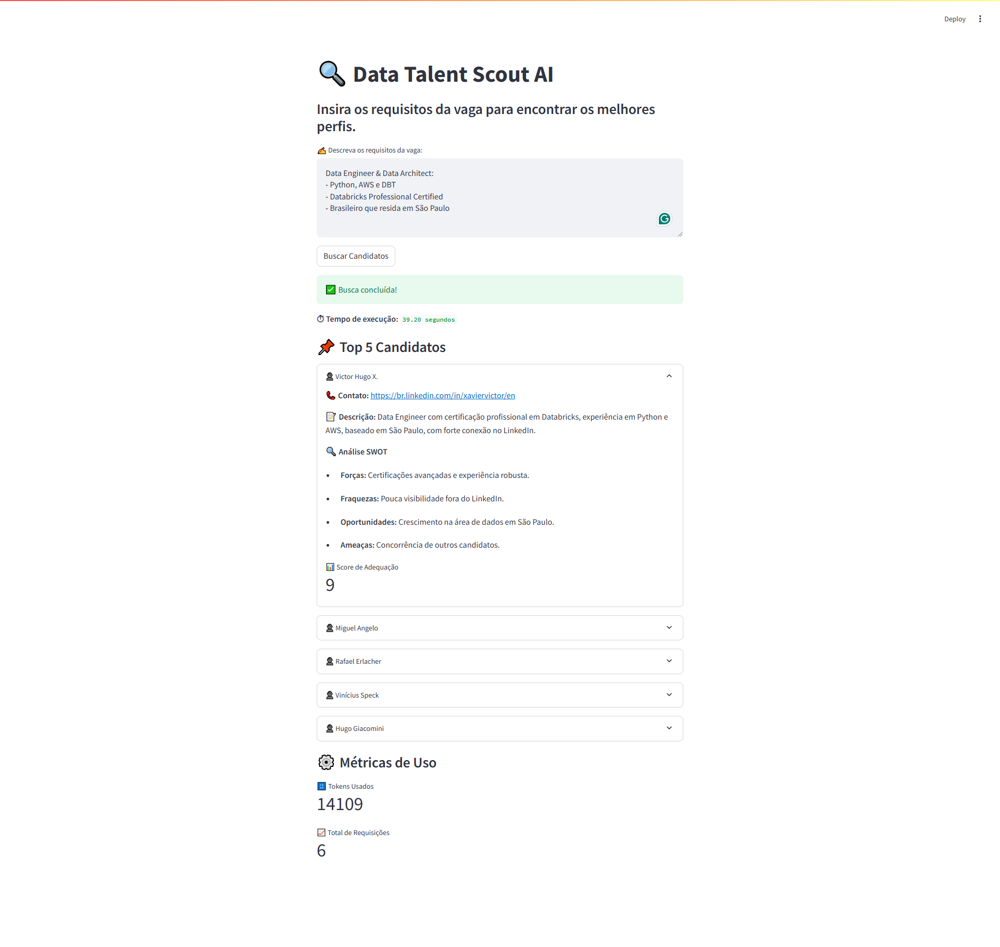

<h1 align="center">Data Talent Scout AI</h1> 

<div align="center">
  
  
  
</div>

<p align="center">

</p>

## Visão Geral

Este projeto é um sistema inteligente de recrutamento especializado em vagas de dados, utilizando agentes de IA para identificar os melhores candidatos com base nos requisitos da vaga. A aplicação integra um backend desenvolvido em FastAPI, agentes de IA construídos com CrewAI e um frontend interativo em Streamlit. O objetivo é facilitar o processo de recrutamento, permitindo que recrutadores encontrem candidatos qualificados de maneira eficiente e automatizada.

<p align="center">

</p>

## Funcionalidades
- Busca de Candidatos: Utiliza Agentes de IA para realizar pesquisas online e encontrar os top 5 candidatos que atendem aos requisitos da vaga.
- Interface Intuitiva: Frontend em Streamlit que permite aos usuários inserir os requisitos da vaga e visualizar os resultados de forma clara (Geração estruturada de relatórios de candidatos).
- Envio de Resultados por E-mail: Possibilidade de enviar os resultados da busca diretamente para um e-mail especificado.
- Feedback em Tempo Real: Exibe informações sobre o uso de tokens e o tempo de execução da busca.

## Tecnologias Utilizadas
- Backend: FastAPI e NGINX
- Agentes de IA: CrewAI
- Ferramenta de Busca: SerperDevTool
- Frontend: Streamlit
- Envio de E-mails: Biblioteca personalizada (sendmail.py)

#### FastAPI com Swagger
- **Descrição:** FastAPI é um framework moderno e de alto desempenho para a construção de APIs com Python 3.6+ baseado em tipos de dados. Ele é projetado para ser rápido e fácil de usar, oferecendo validação automática de dados e documentação interativa.
- **Uso no Projeto:** Utilizado para criar a API que manipula dados de recrutamento de trabalhos. O FastAPI gera automaticamente a documentação da API utilizando Swagger, permitindo que os desenvolvedores testem as endpoints diretamente pela interface.
- **Acessando o Swagger:** Após iniciar a aplicação com o comando `uvicorn main:app --reload`, a documentação do Swagger pode ser acessada em `http://127.0.0.1:80/docs`.

<p align="center">

</p>

## Arquitetura de Agentes IA com CrewAI
O sistema utiliza o framework CrewAI para criar uma equipe especializada de agentes inteligentes que colaboram no processo de recrutamento. Cada agente possui funções e capacidades específicas:

AgentAI 1 (Recrutador Senior de Dados)
- Função: Identificar os melhores perfis de dados com base nos requisitos da vaga
- Tool: SerperDevTool (usada para efetuar pesquisas externas, especialmente no LinkedIn)
- Responsabilidade: Pesquisar os candidatos e retornar um JSON contendo até 5 perfis ideais, e realizar analise SWOT dos candidatos

AgentAI 2 (Validador de Candidatos)
- Função: Validar e enriquecer informações dos candidatos coletados
- Tool: (Nenhuma específica além do LLM interno)
- Responsabilidade: Conferir se os dados dos perfis estão completos e coerentes

AgentAI 3 (Classificador de Candidatos)
- Função: Atribuir um score de adequação (1-10) a cada candidato. Classificar os candidatos com base nos requisitos da vaga e informações coletadas
- Tool: (Nenhuma específica além do LLM interno)
- Responsabilidade: Ranquear e priorizar os candidatos conforme os requisitos da vaga

AgentAI 4 (Formatador de Candidatos)
- Função: Formatar os dados de cada candidato em JSON válido (modelo Pydantic)
- Tool: (Nenhuma específica além do LLM interno)
- Responsabilidade: Garantir a saída final organizada, com campos padronizados

<p align="center">

</p>

#### NGINX
- **Descrição:** NGINX é um servidor web de alto desempenho que também pode atuar como um balanceador de carga e proxy reverso. Sua arquitetura assíncrona o torna extremamente rápido e eficiente no uso de recursos.
- **Uso no Projeto:** O NGINX está sendo usado como load balancer, distribuindo as requisições entre múltiplas instâncias do backend (Backend-1, Backend-2, Backend-3). Assim, se algum backend estiver sobrecarregado, o NGINX encaminha requisições para outro backend disponível. Ele garante maior disponibilidade (caso um container falhe, ainda há outros disponíveis), ajuda na escalabilidade (suportando mais requisições) e melhora a performance ao distribuir de forma equilibrada o tráfego entre os backends.



#### **Streamlit**

- **Descrição:** Streamlit é uma biblioteca Python de código aberto que permite a criação de aplicativos web interativos de forma rápida e fácil. Utilizado principalmente para construir dashboards e interfaces de dados, o Streamlit é ideal para prototipagem rápida e visualização de dados sem a necessidade de conhecimentos avançados em desenvolvimento web.
- **Uso no Projeto:** Utilizado para construir o frontend da aplicação, permitindo que os usuários insiram dados de requisitos específicos da vaga, como habilidades, certificações e localização de forma interativa e visualizem os resultados diretamente na interface.

<p align="center">
  
</p>

#### Como Usar
1. Insira os Requisitos da Vaga
- No campo de texto, digite os requisitos específicos da vaga, como habilidades, certificações e localização.
2. Inicie a Busca
- Clique no botão "Buscar" para iniciar a pesquisa de candidatos.
3. Visualize os Resultados
- Após a conclusão da busca, os top 5 candidatos serão listados, incluindo informações de contato, breve descrição do perfil e URL para o perfil.
- Informações adicionais, como uso de tokens e tempo de execução, também serão exibidas.
4. Envie os Resultados por E-mail
- Insira o e-mail do destinatário no campo fornecido.
- Clique no botão "Enviar E-mail" para enviar os resultados da busca.

<p align="center">
  
</p>

## Instalação

1. Clone o repositório:
```bash
git clone https://github.com/seu-usuario/ai-agents-hub.git
cd ai-agents-hub/02 - Recursos Humanos (RH)/Data_Talent_Scout_AI
```

2. Configure as chaves de API no arquivo `.env`:
```env
OPENAI_API_KEY=sua-chave
SERPER_API_KEY=sua-chave
```

3. Para iniciar a aplicação, execute:
```bash
docker-compose up -d --build
```

4. Prepare o Frontend
- Certifique-se de que o arquivo sendmail.py esteja configurado corretamente para enviar e-mails.

## Executando a Aplicação

1. Inicie o Servidor FastAPI:
```bash
cd app/backend/
uvicorn main:main --reload
```
- O servidor será executado em http://127.0.0.1:8000.

2. Execute o Frontend Streamlit (http://localhost:8501/)
```bash
cd app/frontend/
streamlit run app.py
```
- A interface será aberta no seu navegador padrão.

3. Se preferir, pode usar o Curl para enviar uma requisição POST :
```bash
curl -X POST "http://localhost:8000/research_candidates" \
-H "Content-Type: application/json" \
-d '{"job_requirements": "Data Engineer & Data Architect:
- Python, AWS e DBT 
- Databricks Professional Certified 
- Brasileiro que resida em São Paulo"}'
```

## Configuração

| Variável de Ambiente | Descrição                           | Como Obter                 |
|----------------------|-----------------------------------|---------------------------|
| `OPENAI_API_KEY`     | Chave da API OpenAI               | platform.openai.com        |
| `SERPER_API_KEY`     | Chave da API de Pesquisa Serper   | serper.dev                |


